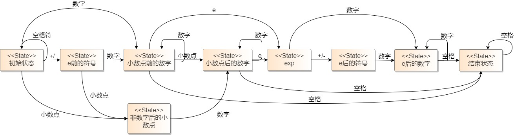
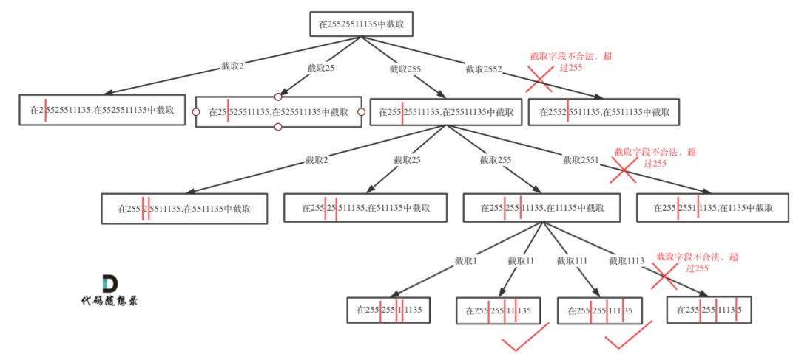

# 【算法】字符串

## 思路与误区

**背景**

OJ考试时不会打印错误用例，一但进入误区，很难走出来

**踩坑**

- 缩小字符集的范围：区分大小写？包含除字母外的字符如符号？
- 缩小字符的出现频次：考虑字符可能不只出现一次，而是出现多次
- 忽略空字符串
- 忽略边界条件
- 全相同输入（超时考虑）
- 想着先实现再改进

**思路**

- 认真读题 - 思考极端用例
- 思考算法 - 验证用例
- 实现算法

**极端用例CheckList**

做题时可对照checklist一一构造用例

- [ ] 字符集：全ASCII？还是……
  - 使用给定用例字符外的字符

- [ ] 出现频次：是否说明字符唯一？
  - 构造用例，让字母出现频次>1

- [ ] 空字符串：是否禁止？
  - 构造空串输入

- [ ] 全相同输入：是否禁止？
  - 构造全相同输入
- [ ] 边界条件：极端情况
  - 字符串转整数时，考虑INT_MAX, INT_MIN

**其它坑**

- 内存越界：数组，string
- 整数越界
  - INT32_MAX + num
- LeetCode内存统计
  - 统计所有使用过的内存 -> 尽量避免使用拷贝


## 子串问题（滑动窗口）

### 通用解法：双指针法

**适用条件：后移tail无影响或所带来的影响可以通过后移head来弥补**

通用解法：时间复杂度O(N)

- 后移tail，如果新增元素会导致条件不成立时，后移head保证条件匹配

LeetCode-3：无重复字符的最长子串

```python
# 输入: "abcabcbb"
# 输出: 3 

class Solution:
    def lengthOfLongestSubstring(self, s: str) -> int:
        """ 双指针解法 """
        n = len(s)
        if n <= 1:
            return n
        head, tail = 0, 1
        ans = 0
        while tail < n:
            if s[tail] in s[head: tail]:
                ans = max(ans, tail - head)
                # head指针后移
                head += s[head: tail].index(s[tail]) + 1
            tail += 1
        ans = max(ans, tail - head)
        return ans
```


LeetCode-76：[最小覆盖子串](https://leetcode-cn.com/problems/minimum-window-substring/)

> 给你一个字符串 s 、一个字符串 t 。返回 s 中涵盖 t 所有字符的最小子串。如果 s 中不存在涵盖 t 所有字符的子串，则返回空字符串 "" 。 

```json
输入：s = "ADOBECODEBANC", t = "ABC"
输出："BANC"
```

题解：双指针法

```python
from collections import defaultdict

class Solution:
    def minWindow(self, s: str, t: str) -> str:
        k, n = len(t), len(s)
        if k > n:
            return ""
        
        # hashmap记录滑动窗口需要的元素
        hash_map = defaultdict(int)
        for item in t:
            hash_map[item] += 1
            
        ans = s
        head, tail = 0, 0
        need_cnt = k	# needcnt记录需要元素的总数
        flag = 0		# 标记ans是否修改

        while head <= tail:
            # 移动右指针，直到满足包含条件
            while tail < n and need_cnt:
                if hash_map[s[tail]] > 0:
                    need_cnt -= 1
                hash_map[s[tail]] -= 1
                tail += 1
            # 满足包含条件且答案更短时，更新ans
            if not need_cnt and len(ans) >= tail - head:
                flag = 1
                ans = s[head:tail]

            # 移动左指针
            if head < n:
                hash_map[s[head]] += 1
                if hash_map[s[head]] > 0:
                    need_cnt += 1
            head += 1

        return ans if flag else ""
```


### 扩展：子串匹配

子串匹配是十分常见的字符串题型，常见子串匹配场景有：

#### 1. 子串匹配：子串**完全匹配**长串的一部分

LeetCode-459：[重复的子字符串](https://leetcode-cn.com/problems/repeated-substring-pattern/)

> 给定一个非空的字符串，判断它是否可以由它的一个子串重复多次构成。给定的字符串只含有小写英文字母，并且长度不超过10000。

```json
输入: "abcabcabcabc"
输出: True
解释: 可由子字符串 "abc" 重复四次构成。 (或者子字符串 "abcabc" 重复两次构成。)
```

**KMP算法**

**快速**找出模式串在长串中的位置，时间复杂度O(m+n)

```python
class KMP:
    @staticmethod
    def partial(pattern: str) -> [int]:
        """ Calculate partial match table """
        nex: list = [0]

        for i in range(1, len(pattern)):
            j = nex[i - 1]
            while j > 0 and pattern[j] != pattern[i]:
                j = nex[j - 1]
            nex.append(j + 1 if pattern[j] == pattern[i] else j)
        return nex

    def search(self, s: str, p: str) -> [int]:
        """ Return all the matching position of pattern string P in T """
        nex, ret, j = self.partial(p), [], 0

        for i in range(len(s)):
            while j > 0 and s[i] != p[j]:
                j = nex[j - 1]
            if s[i] == p[j]:
                j += 1
            if j == len(p):
                ret.append(i - (j - 1))
                j = nex[j - 1]
                #j = 0 # 相同字母不重复利用, 如 aaa 找 aa

        return ret
        
kmp = KMP()
pos = kmp.search(s, p)
```


#### 2. 子序列：子串按**相对位置顺序**包含在长串中

**子序列** 是指由原字符串部分字母组成，且保持相对位置顺序不变的新字符串。

例如，"ACE" 是 "ABCDE" 的一个子序列，而 "AEC" 不是。

此类题型常见的解法有两种，**双指针和动态规划**。

Leetcode-392：[判断子序列](https://leetcode-cn.com/problems/is-subsequence/)

> 给定字符串 **s** 和 **t** ，判断 **s** 是否为 **t** 的子序列。

```json
输入：s = "abc", t = "ahbgdc"
输出：true

输入：s = "axc", t = "ahbgdc"
输出：false
```

题解：双指针法

```python
class Solution:
    def isSubsequence(self, s: str, t: str) -> bool:
        """ 返回s是否t的子序列 """
        p, q = 0, 0
        while p < len(s) and q < len(t):
            if s[p] == t[q]:
                p += 1
            q += 1
        return p == len(s)
```


Leetcode-115：[不同的子序列](https://leetcode-cn.com/problems/distinct-subsequences/)

> 给定一个字符串 s 和一个字符串 t ，计算在 s 的子序列中 t 出现的个数。

```json
输入：s = "babgbag", t = "bag"
输出：5
解释：
如下所示, 有 5 种可以从 s 中得到 "bag" 的方案。 
```

​			**ba**b**g**bag
​			**ba**bgba**g**
​			**b**abgb**ag**
​			ba**b**gb**ag**
​			babg**bag**

**动态规划**

解动态规划问题，脑海里立马要想到动态规划**三要素** `最优子结构`、`状态定义`、`状态转移方程`，列出来逐一回答思路就清晰了。

1. 划分子问题（找最优子结构）
   - 统计模式串`bag`出现次数时，我们可以先在长串中统计子串 `b` 的出现次数，求解子问题的最优解
   - 然后，再求解子问题 `ba` 的最优解，以此类推
   - **技巧：找最简单的问题，从下往上递推**。比如对于新手来说本题直接找到 `bag` 的最优解是很难的，但如果只是统计一个字母的出现次数那就十分简单了。在解决了一个字母的情况下，再逐步尝试解决更难的问题，往往更容易发现其中的规律。

2. 定义状态

   - 每个状态 $dp[i][j]$ 表示 $t[:i]$ 子串在序列 $s[:j]$ 的出现次数

   - **技巧：**

     - dp入门建议从二维矩阵入手（目前为止解决了我遇到的绝大部分问题）

     - 在解决最简单的问题过程中找到状态定义。如求解统计一个字母的出现次数时，我的求解过程如下：

       |      | b    | a    | b    | g    | b    | a    | g    |
       | ---- | ---- | ---- | ---- | ---- | ---- | ---- | ---- |
       | b    | 1    | 1    | 2    | 2    | 3    | 3    | 3    |

3. 状态转移方程
   
   - 当你推演了从简单问题到复杂问题的求解过程后，一般都能在 $dp[i-1:i][j-1:j]$ 之间找到状态转移的规律：

$$
dp(i,j)=
	\begin{cases}
		dp(i,j-1)+dp(i-1,j-1), & t[i] == s[j] \quad and \quad i,j>0\\
		dp(i,j-1), & t[i] != s[j] \quad and \quad i,j > 0
	\end{cases}
$$


```python
class Solution:
    def numDistinct(self, s: str, t: str) -> int:
        m, n = len(t), len(s)
        # 初始化DP矩阵
        dp = [[0 for _ in range(n)] for _ in range(m + 1)]
        # 偶尔会使用的技巧：在第1行前加1行，目的是使第1行也符合状态转移方程公式
        # 不加额外行，单独处理第1行也是可以的，状态转移方程从第2个字母开始
        dp[0] = [1] * n		
        dp[1][0] = 0 + (s[0] == t[0])
        # print(dp)
        for i in range(1, m + 1):
            for j in range(i - 1, n):
                if j > 0:
                    if t[i - 1] == s[j]:
                        dp[i][j] = dp[i][j - 1] + dp[i - 1][j - 1]
                    else:
                        dp[i][j] = dp[i][j - 1]
        # print(dp)
        return dp[-1][-1]
```


#### 3. 子串包含：子串所有字母是否包含在长串中，与字符顺序无关

   需要考虑以下两点：

   - 子串所有元素均出现在长串中
   - 出现元素的数量要满足包含关系

**哈希**

LeetCode-76：[最小覆盖子串](https://leetcode-cn.com/problems/minimum-window-substring/)

> 如何判断滑动窗口内是否包含子串t所有元素？

可以使用一个哈希表 `hash_map` 来记录当前滑动窗口中**需要的各元素及数量**。初始状态滑动窗口为空，需要T中所有元素，因此，初始 `hash_map` 为：

```python
# hashmap记录滑动窗口需要的元素
hash_map = defaultdict(int)
for item in t:
	hash_map[item] += 1
    
# 假设长串为s，子串为t
s = "ADOBECODEBANC", t = "ABC"
# 则hash_map中记录了当前滑动窗口所需元素
hash_map = {'A':1, 'B':1, 'C':1}
```

当滑动窗口扩展或收缩时，去维护 `hash_map` ，当滑动窗口新增某元素时，使 `hash_map` 中该元素数量减1；当滑动窗口移除某元素时，则使 `hash_map` 中该元素数量加1。哈希表中可能出现负数的情况，表示元素是多余的，如当窗口包含`ADO`时， `hash_map` 为 `{'A':0, 'D':-1, 'O':-1, 'B':1, 'C':1}` ，表示 `D`，`O` 是多余的，此时还差一个 `B` 和 `C`。此时，当 `hash_map` 中所有元素数量均小于等于0时，表明滑动窗口包含子串中所有元素。

若每次判断滑动窗口内是否包含子串t所有元素都去遍历 `hash_map` ，时间复杂度为 `O(k)`，最坏情况下，k可能等于`len(s)`。优化手段是，维护一个额外的变量 `need_cnt` 来记录所需元素的总数量，当碰到一个所需元素在  `hash_map` 中记录大于0时，则 `need_cnt` 数量减少1，这样通过 `need_cnt` 就可以知道是否满足包含关系，无需遍历字典了。


#### 4. 超长字符串匹配

暴力匹配字符串总是十分耗时的，特别是字符串特别长的时候。而通过哈希函数**把字符串匹配问题转换成数值之间的比较**，可极大提高字符串匹配效率：$O(n)\rightarrow O(1)$。

**哈希函数**

```python
# If you need to import additional packages or classes, please import here.

import hashlib
import sys


def func(n, q, files, modify):
    # please define the python3 input here.
    # For example: a,b = map(int, input().strip().split())
    # please finish the function body here.
    # please define the python3 output here. For example: print().

    def get_md5(s: str) -> int:
        h = hashlib.md5()
        h.update(s.encode("utf-8"))
        return int(h.hexdigest(), 16) % sys.maxsize

    def zip_files(data):
        key = 0
        for i, item in enumerate(data):
            key += (i + 1) ** 2 + get_md5(item)
        return key

    history_version = dict()
    last_version = zip_files(files)
    ver = 0
    history_version[last_version] = ver

    # 遍历数据
    for file, content in modify:
        ver += 1
        file = int(file)
        # 修改文件内容
        last_version -= (file ** 2 + get_md5(files[file - 1]))
        last_version += file ** 2 + get_md5(content)
        files[file - 1] = content
        # 比较历史版本
        if last_version in history_version:
            print(history_version[last_version])
        else:
            print(-1)
            history_version[last_version] = ver


def read_data():
    n, q = map(int, input().strip().split())
    files = input().strip().split()
    modify = [input().strip().split() for _ in range(q)]
    return n, q, files, modify


if __name__ == "__main__":
    func(*read_data())
```


## 回文串问题（中心对称）

- 本质上说，对象问题，以下标i或i+0.5为中心，计算左右两边字符是否镜像相等
  - **注意：bab是回文串，baab也是回文串，一定记着计算两种对称**
- 往往与子串问题结合
- 常规解法
  - 暴力法：以i或i+0.5为中心，计算两种对称，**暴力解能解决大部分问题**
  - 最长子串剪枝法
  - 最短子串剪枝法


LeetCode-125：验证回文串

给定一个字符串，验证它是否是回文串，只考虑字母和数字字符，可以忽略字母的大小写。 

判断是否回文：双指针。

```python
# 输入: "A man, a plan, a canal: Panama"
# 输出: true
# 解释："amanaplanacanalpanama" 是回文串

"""
思路：筛选+判断，先把字母和数字提出来再利用双指针判断是否回文，O(|s|)+O(|s|)
"""
class Solution:
    def isPalindrome(self, s: str) -> bool:
        sgood = "".join(ch.lower() for ch in s if ch.isalnum())
        n = len(sgood)
        left, right = 0, n - 1

        while left < right:
            if sgood[left] != sgood[right]:
                return False
            left, right = left + 1, right - 1
        return True

"""
思路：双指针，遇到非字母和数字跳过，判断小写是否相等。O(|s|)+O(1)
"""
class Solution:
    def isPalindrome(self, s: str) -> bool:
        head, tail = 0, len(s) - 1
        while head < tail:
            while head < len(s) and not s[head].isalnum():
                head += 1
            while tail >= 0 and not s[tail].isalnum():
                tail -= 1
            if head <= tail:
                if s[head].lower() == s[tail].lower():
                    head += 1
                    tail -= 1
                else:
                    return False
        return True

```


LeetCode-5：最长回文子串

给你一个字符串 `s`，找到 `s` 中最长的回文子串。

有动态规划和中心扩展法两种，中心扩展效率更高。

```python
# 输入：s = "babad"
# 输出："bab"
# 解释："aba" 同样是符合题意的答案。

class Solution:
    def longestPalindrome(self, s: str) -> str:
        """
        中心扩展法：以当前字符为中心往两头扩展，注意奇数和偶数两种情况即可
        """
        def center_extension(left, right):
            while left >= 0 and right < len(s) and s[left] == s[right]:
                left -= 1
                right += 1
            return left + 1, right - 1

        start, end = 0, 0
        for i in range(len(s)):
            l, r = center_extension(i, i)
            if r - l > end - start:
                start, end = l, r

            l, r = center_extension(i, i + 1)
            if r - l > end - start:
                start, end = l, r

        return s[start:end + 1]
```


LeetCode-214：最短回文串

给定一个字符串 ***s***，你可以通过**在字符串前面添加**字符将其转换为回文串。找到并返回可以用这种方式转换的最短回文串。

```python
# 输入：s = "abcd"
# 输出："dcbabcd"

# 构造样例
s="A"			- "A"
s="aaa"		- "aaa"
s=""			- ""
s="aaac" 	- "caaac"

"""
根据题目“在字符串前面添加”，若把字符串拆分成 s = s[front] + s[back]，其中s[front]构成回文子串，
则 待构造的回文串 = s[back][::-1] + s[front] + s[back]
因此问题转换：找到字符串前半部分最长的回文子串，把后半部分逆序拼接到开头即可

解法：
    1. 判断当前i能否与0构成回文，若可以则取最大的i的右边界r，O(n^2)
    2. 把 s[r+1:] 逆序拼接到开头
    
    优化1：i从中间开始
    优化2：找到右边界提前结束
    优化3：只判断与开头是否为回文即可
"""
class Solution:
    def shortestPalindrome(self, s: str) -> str:
        def is_palindrome_with_head(left, right):
            return s[:left + 1] == s[right: right + left + 1][::-1]

        n = len(s)
        idx = 0
        i = n >> 1
        while i >= 0:
            if is_palindrome_with_head(i, i + 1):
                idx = 2 * i + 2
            if idx:
                break

            if is_palindrome_with_head(i, i):
                idx = 2 * i + 1
            if idx:
                break
            i -= 1

        return s[idx:][::-1] + s

```


## 前向依赖问题（状态机）

- 适合场景：处理当前需要考虑过去（前向依赖）
- 思路：将依赖表示为状态转换
- 要素：
  - 1：状态表示/处理
  - 2：转换条件
- 解题步骤：
  - 找状态和输入信号，画出状态图
  - 找状态转移条件/规则
  - （如果有）找状态对应的处理
- 特点
  - 代码调试模版化
  - 状态转换图画好，代码基本不会错


LeetCode-[剑指 Offer 20. 表示数值的字符串](https://leetcode-cn.com/problems/biao-shi-shu-zhi-de-zi-fu-chuan-lcof/)

>实现一个函数：判断字符串是否表示数值（包括整数和小数）
>
>数值（按顺序）可以分成以下几个部分：
>
>1. 若干空格
>2. 一个 小数 或者 整数
>3. （可选）一个 'e' 或 'E' ，后面跟着一个 整数
>4. 若干空格
>
>小数（按顺序）可以分成以下几个部分：
>
>1. （可选）一个符号字符（'+' 或 '-'）
>2. 下述格式之一：
>   - 至少一位数字，后面跟着一个点 '.'
>   - 至少一位数字，后面跟着一个点 '.' ，后面再跟着至少一位数字
>   - 一个点 '.' ，后面跟着至少一位数字
>
>整数（按顺序）可以分成以下几个部分：
>
>1. （可选）一个符号字符（'+' 或 '-'）
>2. 至少一位数字
>   
>
>部分数值列举如下：
>
>["+100", "5e2", "-123", "3.1416", "-1E-16", "0123"]
>部分非数值列举如下：
>
>["12e", "1a3.14", "1.2.3", "+-5", "12e+5.4"]

解题过程：

1. 找状态和输入信号，画出状态图（关键步骤，基本上等于全部工作量）

   

2. 总结状态转移规则和对应处理，整理数据操作表

Code：

```python
from enum import Enum


class Solution:
    def isNumber(self, s: str) -> bool:
        # 定义状态
        state = Enum("State", [
            "STATE_INITIAL",
            "STATE_SIGN_BEFORE_EXP",
            "STATE_NUM_BEFORE_DOT",
            "STATE_NUM_AFTER_DOT",
            "STATE_DOT_AFTER_NOT_NUM",
            "STATE_EXP",
            "STATE_SIGN_AFTER_EXP",
            "STATE_NUM_AFTER_EXP",
            "STATE_END",
        ])
        # 定义输入信号
        chartype = Enum("Chartype", [
            "CHAR_NUMBER",
            "CHAR_EXP",
            "CHAR_POINT",
            "CHAR_SIGN",
            "CHAR_SPACE",
            "CHAR_ILLEGAL",
        ])
        
        def to_chartype(ch: str) -> chartype:
            if ch.isdigit():
                return chartype.CHAR_NUMBER
            elif ch.lower() == "e":
                return chartype.CHAR_EXP
            elif ch == ".":
                return chartype.CHAR_POINT
            elif ch == "+" or ch == "-":
                return chartype.CHAR_SIGN
            elif ch == " ":
                return chartype.CHAR_SPACE
            else:
                return chartype.CHAR_ILLEGAL
            
        # 状态转移：当前状态 + 输入信号 = 下一状态
        transfer = {
            state.STATE_INITIAL: {
                chartype.CHAR_SPACE: state.STATE_INITIAL,
                chartype.CHAR_NUMBER: state.STATE_NUM_BEFORE_DOT,
                chartype.CHAR_POINT: state.STATE_DOT_AFTER_NOT_NUM,
                chartype.CHAR_SIGN: state.STATE_SIGN_BEFORE_EXP
            },
            state.STATE_SIGN_BEFORE_EXP: {
                chartype.CHAR_NUMBER: state.STATE_NUM_BEFORE_DOT,
                chartype.CHAR_POINT: state.STATE_DOT_AFTER_NOT_NUM
            },
            state.STATE_DOT_AFTER_NOT_NUM: {
                chartype.CHAR_NUMBER: state.STATE_NUM_AFTER_DOT
            },
            state.STATE_NUM_BEFORE_DOT: {
                chartype.CHAR_NUMBER: state.STATE_NUM_BEFORE_DOT,
                chartype.CHAR_EXP: state.STATE_EXP,
                chartype.CHAR_POINT: state.STATE_NUM_AFTER_DOT,
                chartype.CHAR_SPACE: state.STATE_END
            },
            state.STATE_NUM_AFTER_DOT: {
                chartype.CHAR_NUMBER: state.STATE_NUM_AFTER_DOT,
                chartype.CHAR_EXP: state.STATE_EXP,
                chartype.CHAR_SPACE: state.STATE_END
            },
            state.STATE_EXP: {
                chartype.CHAR_NUMBER: state.STATE_NUM_AFTER_EXP,
                chartype.CHAR_SIGN: state.STATE_SIGN_AFTER_EXP
            },
            state.STATE_SIGN_AFTER_EXP: {
                chartype.CHAR_NUMBER: state.STATE_NUM_AFTER_EXP,
            },
            state.STATE_NUM_AFTER_EXP: {
                chartype.CHAR_NUMBER: state.STATE_NUM_AFTER_EXP,
                chartype.CHAR_SPACE: state.STATE_END
            },
            state.STATE_END: {
                chartype.CHAR_SPACE: state.STATE_END
            },
        }

        st = state.STATE_INITIAL
        for ch in s:
            typ = to_chartype(ch)
            if typ not in transfer[st]:
                return False
            st = transfer[st][typ]
		
        # 判断最终状态是否合法即可
        return st in [state.STATE_NUM_BEFORE_DOT, state.STATE_NUM_AFTER_DOT, state.STATE_NUM_AFTER_EXP, state.STATE_END]
```


练习：LeetCode-8：[字符串转换整数 (atoi)](https://leetcode-cn.com/problems/string-to-integer-atoi/)


## 子问题求解：分形与递归

- 子问题拆分
- 生成拆分表达式
- 常用技巧
  - 使用类成员对象存储中间变量
  - 主函数调用时对类成员对象进行初始化
- 注意
  - C++尽量不要用set进行迭代，set.insert(), set.erase()开销太大


LeetCode-93：[复原IP地址](https://leetcode-cn.com/problems/restore-ip-addresses/)

> 有效 IP 地址 正好由四个整数（每个整数位于 0 到 255 之间组成，且不能含有前导 0），整数之间用 '.' 分隔。 
>
> 给定一个只包含数字的字符串 s ，用以表示一个 IP 地址，返回所有可能的有效 IP 地址，这些地址可以通过在 s 中插入 '.' 来形成。你不能重新排序或删除 s 中的任何数字。你可以按 任何 顺序返回答案。
>
> 例如："0.1.2.201" 和 "192.168.1.1" 是 有效 IP 地址，但是 "0.011.255.245"、"192.168.1.312" 和"192.168@1.1" 是 无效 IP 地址。 

```json
输入：s = "1111"
输出：["1.1.1.1"]

输入：s = "101023"
输出：["1.0.10.23","1.0.102.3","10.1.0.23","10.10.2.3","101.0.2.3"]
```

**回溯**

解题思路：该题是典型的“选择”题，每次操作可按序取数（做选择），最后判断当前选择（路径）是否符合题目限制。直接套用回溯模板即可。

懒得画图，借用题解[@代码随想录](https://leetcode-cn.com/problems/restore-ip-addresses/solution/dai-ma-sui-xiang-lu-93-fu-yuan-ip-di-zhi-pzjo/)的一张图，便于大家理解，侵删。



个人总结的回溯模板，一般按模板步骤思考即能得到解题答案

```python
ans = []	# 记录合法的路径，即答案

def backtrack(path, opts):
    """
    :params path: 记录选择路径/候选答案
    :params opts: 剩余选择
    """
    # 1. 递归结束条件
    if not opts:	# 一般opts为空即停止，因为已经没有可做的选择；有时也可根据path判断提前停止，即剪枝
        if path:	# 有时需要判断path是否符合题意，满足约束的即为答案
            ans.append(path)
        return		# 记得返回
    
    # 2. 做选择
    # 一般遍历opts按顺序取数或截取
    for i, opt in enumerate(opts):
        # 对选择后的路径与剩余选择重复以上过程
        backtrack(path + [opt], opts[i+1:])
```

Code：

```python
class Solution:
    def restoreIpAddresses(self, s: str):
        """
        回溯
        三个点，每次可放位置是从当前位置后数三个，合理分完，记录结束
        合法性检查
            0-255
            除了0以外，不能以0开头
        """

        def validation(num):
            """ 合法性检查：满足ip的条件 """
            if not num or (num.startswith('0') and len(num) > 1):
                return False
            elif 0 <= int(num) < 256:
                return True
            else:
                return False

        ans = []

        def backtrack(path, opt):
            # 递归结束条件
            if not opt:
                idx = path[-1]
                if validation(s[idx:]):
                    tmp = [s[path[i]:path[i + 1]] for i in range(len(path) - 1)]
                    tmp.append(s[idx:])
                    ans.append('.'.join(tmp))
                return
			# 做选择
            for i in range(1, 4):
                idx = path[-1]
                if validation(s[idx: idx + i]):
                    backtrack(path + [idx + i], opt - 1)

        # 这里以下标作为路径标记和选择判断
        backtrack([0], 3)
        return ans
```


LeetCode-87：扰乱字符串


## BFS/DFS+字符串问题

LeetCode-22：[括号生成](https://leetcode-cn.com/problems/generate-parentheses/)

> 数字 `n` 代表生成括号的对数，请你设计一个函数，用于能够生成所有可能的并且 **有效的** 括号组合。

```json
输入：n = 3
输出：["((()))","(()())","(())()","()(())","()()()"]
```

“选择题”，套回溯模板。

```python
class Solution:
    def generateParenthesis(self, n: int) -> List[str]:
        ans = []
        # l,r 组成 opts ，表示剩余多少左括号和多少右括号
        def backtrack(path, l, r):
            # 左、右括号用完即没有选择，记录答案，停止操作
            if l == 0 and r == 0:
                ans.append(path)
                return
           	# 做选择
            if l > 0:
                backtrack(path+'(', l-1, r)
            if r > 0 and r > l:
                backtrack(path+')', l, r-1)
                
        backtrack('', n, n)
        return ans
```


练习：LeetCode-17：[电话号码的字母组合](https://leetcode-cn.com/problems/letter-combinations-of-a-phone-number/)

思路：全排列问题是典型的“选择题”。


## 成对匹配问题

- 适用场景：通常进行字符的匹配，如引号，括号等
- 成对字符记为cL/cR，cL...cR成对出现
- 通用算法：**栈**
  - 出现cL字符，入栈
  - 出现cR字符，出栈，判断以下条件
    - 当前栈为空，匹配失败
    - 当前栈顶不是cR字符，匹配失败
  - 字符串遍历结束，栈非空，完全匹配失败


LeetCode-20：[有效的括号](https://leetcode-cn.com/problems/valid-parentheses/)

> 给定一个只包括 '('，')'，'{'，'}'，'['，']' 的字符串 s ，判断字符串是否有效。
>
> 有效字符串需满足：
>
> ​	左括号必须用相同类型的右括号闭合。
> ​	左括号必须以正确的顺序闭合。

```json
输入：s = "()[]{}"
输出：true

输入：s = "([)]"
输出：false
```

Code：

```python
class Solution:
    def isValid(self, s: str) -> bool:
        stack = []
        cr = (")", "}", "]")

        def is_pair(c1, c2):
            return c1+c2 in ("()", "[]", "{}")

        for ch in s:
            if ch in cr:
                if not stack or not is_pair(stack[-1], ch):
                    return False
                else:
                    stack.pop()
            else:
                stack.append(ch)
                
        return len(stack) == 0
```


LeetCode-32：[最长有效括号](https://leetcode-cn.com/problems/longest-valid-parentheses/)

> 给你一个只包含 `'('` 和 `')'` 的字符串，找出最长有效（格式正确且连续）括号子串的长度。
>
> - `0 <= s.length <= 3 * 10^4`
> - `s[i]` 为 `'('` 或 `')'`

```json
输入：s = ")()())(())"
输出：4
解释：最长有效括号子串是 "()()"或"(())"
```

**栈**


**动态规划**

三要素

划分子问题（最优子结构）

- 这是一步构思的过程，从简单问题入手：假设子串为 `()()`，最长括号长度为4，它可以构成长串 `()()()` 的最优解，等于4+2=6

- 这一步的作用是判断能否用 dp 算法，该题显然是可以的

状态定义

- 一般dp的假设是用 $dp[i,j]$ 表示字符下标 $i$ 到 $j$ 位置的最优解，但本题显然要求的是$dp[0, i]$，可以直接用 $dp[i]$ 表示从开头到当前位置的最长有效括号即可

状态转移

- 找规律

  | 0    | 1    | 2                | 3    | 4                               | 5    | 6    | 7    | 8                | 9                                |
  | ---- | ---- | ---------------- | ---- | ------------------------------- | ---- | ---- | ---- | ---------------- | -------------------------------- |
  | )    | (    | )                | (    | )                               | )    | (    | (    | )                | )                                |
  | 0    | 0    | 2（与**1**匹配） | 0    | 4（与**3**匹配+子问题的最优解） | 0    | 0    | 0    | 2（与**7**匹配） | 4（与子问题最优解前的**6**匹配） |

  

- 公式总结
  $$
  dp(i)=
  	\begin{cases}
  		dp(i-2)+2, & s[i]=")"  \quad and \quad s[i-1] ="(" \\
  		dp(i-1)+2+dp(i-dp(i-1)-2), & s[i]=")" \quad and \quad s[i-dp[i-1]-1] = "(" \\
          0, & otherwise
  	\end{cases}
  $$

  - $s[i]$ 与$s[i-dp[i-1]-1]$ 是上表**9**与**6**的关系
  - $dp(i-dp(i-1)-2)$ 是子问题最优解

Code：

```python
class Solution:
    def longestValidParentheses(self, s: str) -> int:
        ans = 0
        n = len(s)
        dp = [0] * n
        for i in range(1, n):
            if s[i] == ')':
                if s[i-1] == '(':
                    tmp =  dp[i-2] if i -2 >= 0 else 0
                    dp[i] = tmp + 2
                else:
                    if i-1 >= 0 and i-dp[i-1]-1 >= 0 and s[i-dp[i-1]-1] == '(':
                        tmp = dp[i-dp[i-1]-2] if i-dp[i-1]-2 >= 0 else 0
                        dp[i] = dp[i-1] + tmp + 2
            ans = max(dp[i], ans)
        # print(dp)
        return ans
```


## 抽象语法树生成问题

- 成对匹配问题的进阶版（添加词法解析）
- 特点
  - 根节点代表操作符
  - 子节点代表操作数
  - 根节点+子节点=表达式
  - 递归/分形特性：操作数可以是表达式
- 适用题型
  - 计算器（LC227）
  - 表达式计算（LC1106）
  - 抽象语法树生成（LC385）


