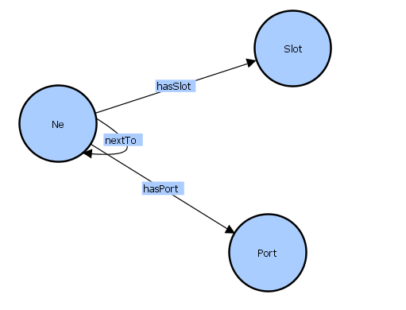

# Demo
假设ontology有如下关系：
网元nextTo网元，网元有Slot槽，网元有Port端口。


同时，有如下三元组数据实例：
```
PREFIX : <http://base#>

:9701-清水苑小区西北 
	:hasSlot :9701-清水苑小区西北-slot-2 ;
	:nextTo :344-干柴李东 ;
	.

:9701-清水苑小区西北-slot-2 
	:hasPort :9701-清水苑小区西北-slot-2-port-1 ;
	.
```

我们的目标是借用规则推理机，根据自定义规则推导出如下关系
```
- Slot inNetworkElement Ne
- Slot hasPort Port
- Port inNetworkElement Ne
- Port inSlot Slot
```

<br>

## 自定义规则并启用推理机
启用Jena推理机其实很简单，只需**配置文件**参数即可。

**步骤**

1. 下载解压fuseki安装包后，根据操作系统选择运行 fuseki-server(Linux) 或 fuseki-server.bat(Windows)，得到/run文件夹（如果不是首次运行，该步可省略）
	- Linux建议在fuseki根目录下运行启动命令，这样/run文件会在根目录下）
	
2. 自定义规则文件，可以在/run/databases下新建一个rules.ttl文件
```
@prefix : <http://base#>

# SlotInNe规则：网元有slot，则slot在网元中
[ruleSlotInNe: (?n :hasSlot ?s) -> (?s :inNetworkElement ?n)]
[rulePortInSlot: (?s :hasPort ?p), (?s :inNetworkElement ?n) -> (?p :inSlot ?s)]
[ruleHasPortTrans: (?n :hasSlot ?s), (?s :hasPort ?p) -> (?n :hasPort ?p), (?p :inNetworkElement ?n)]
```
3. 配置fuseki参数，在/run/configuration下新建一个fuseki_conf.ttl配置文件，复制如下模版，修改**fuseki:name**和**规则文件的路径**。
	- fuseki:name：是数据库名称
   - <#dataset>：可看成宏定义，其表示的是底下定义的rdf dataset
```
@prefix :      <http://base/#> .
@prefix tdb:   <http://jena.hpl.hp.com/2008/tdb#> .
@prefix tdb2:  <http://jena.apache.org/2016/tdb#> .
@prefix rdf:   <http://www.w3.org/1999/02/22-rdf-syntax-ns#> .
@prefix ja:    <http://jena.hpl.hp.com/2005/11/Assembler#> .
@prefix rdfs:  <http://www.w3.org/2000/01/rdf-schema#> .
@prefix fuseki: <http://jena.apache.org/fuseki#> .

<#service1> rdf:type fuseki:Service ;
            fuseki:name                       "kg_db" ;     
            fuseki:serviceQuery               "sparql", "query" ; 
            fuseki:serviceReadGraphStore      "get" ;
            fuseki:serviceReadWriteGraphStore "data" ;
            fuseki:serviceUpdate              "update" ;
            fuseki:serviceUpload              "upload" ;
            fuseki:dataset                   <#dataset> ;
	.

<#dataset> rdf:type ja:RDFDataset ;
	   ja:defaultGraph <#inferenceModel> ;
    .

<#inferenceModel> rdf:type ja:InfModel ;
	# 打开OWL推理机
	# ja:reasoner [ja:reasonerURL <http://jena.hpl.hp.com/2003/OWLFBRuleReasoner>;] ;
	
	# 打开指定规则推理机，并指定规则文件路径
	ja:reasoner [ ja:reasonerURL <http://jena.hpl.hp.com/2003/GenericRuleReasoner> ; 
	              ja:rulesFrom <file:///D:/.../apache-jena-fuseki-3.16.0/run/databases/rules.ttl> ] ;
	.
```

4. 重启fuseki-server.bat服务

5. 在前端选择对应数据库上传数据文件即可


6. 查看结果

    分析：对比上传的初始数据，查询结果中推理出了新的三元组。

<br>

## 自定义规则注意事项

**个人心得**

|      | 事项                                                         | 示例/解释                                                    |
| ---- | ------------------------------------------------------------ | ------------------------------------------------------------ |
| 1    | 推理机只在指定的graph中起作用，新建dataset或graph规则失效    | 在fuseki服务界面，remove dataset，新建同名dataset再上传相同数据，推理失效 |
| 2    | dataset宏定义可修改，如果不需要推理能力，可定义为右边的方式，可自动读入ttl数据，不再需要手动上传数据 |                        |
| 3    | 规则推理机是在上传数据时即自动执行根据规则生成数据           | 手动upload数据后，执行全部数据查询，可以看到根据规则新增的关系 |
| 4    | 规则推理的数据放在内存中，需要自已序列化                     |                                                              |
| 5    | 规则文件中的规则执行并非按顺序的                             | 第三条规则的结果，可能被第一条规则使用                       |