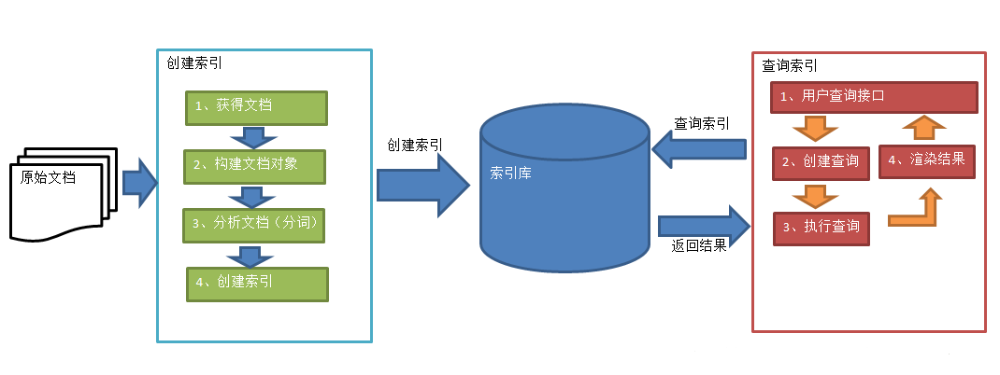
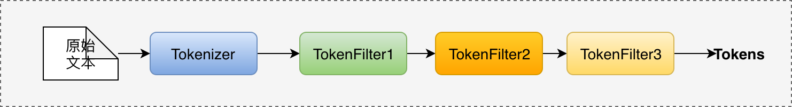
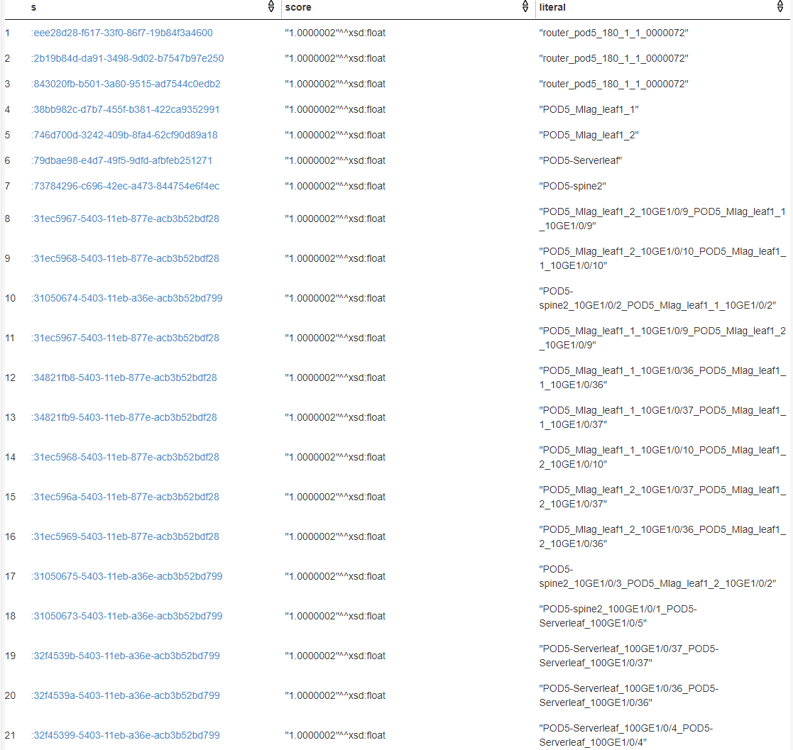
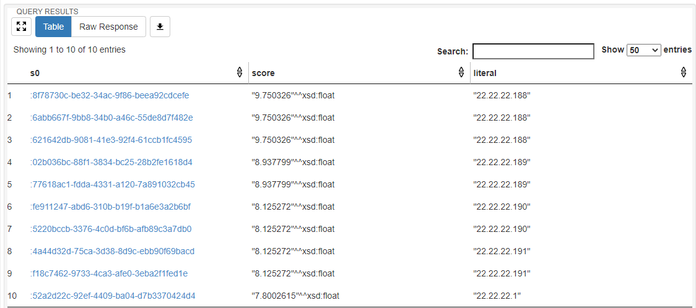

# Jena Full Text Search

本文主要分为三部分
- 全文检索的概念简单介绍
- Jena 全文检索的原理和架构
- 如何配置 Jena 支持全文检索
<br>

如果对全文检索不熟悉的读者，请先阅读 [参考3](#参考) ，会对阅读本文有很大帮助。

## 目录

- [全文检索](#全文检索)
- [Jena全文检索支持](#Jena全文检索支持)
- [架构](#架构)
  - 三元组-文档模型（One triple equals one document）
  - 文档-实体模型（One document equals one entity）
    - 外部索引
  - 外部应用
  - 文档结构
- [配置](#配置)
  - 编辑索引库配置文件
  - 创建索引
  - 索引查询
- [Lucene Analyzer 分析器](#LuceneAnalyzer分析器)
  - Lucene内置的Analyzer
  - Analyzer原理
  - Jena支持的Tokenizer和TokenFilter
- [效果](#效果)
- [参考](#参考)

## 全文检索




<center>索引和搜索流程</center>

**全文检索（Full Text Search）**

>全文检索是非结构化数据查询方法之一。
>
>将非结构化数据中的一部分信息提取出来，重新组织，使其变得有一定结构，然后对此有一定结构的数据进行搜索，从而达到搜索相对较快的目的。这部分**从非结构化数据中提取出的然后重新组织的信息，我们称之索引**。
>
>例如：汉字字典。字典的拼音表和部首检字表就相当于字典的索引，对每一个字的解释是非结构化的，如果字典没有音节表和部首检字表，在茫茫辞海中找一个字只能顺序扫描。然而字的某些信息可以提取出来进行结构化处理，比如读音，就比较结构化，分声母和韵母，分别只有几种可以一一列举，于是将读音拿出来按一定的顺序排列，每一项读音都指向此字的详细解释的页数。我们搜索时按结构化的拼音搜到读音，然后按其指向的页数，便可找到我们的非结构化数据——也即对字的解释。 
>
>这种**先建立索引，再对索引进行搜索的过程就叫全文检索(Full-text Search)**，使用了全文搜索技术后，查询速度将大提升。

<br>

**Lucene**

> Lucene是一套用于全文检索和搜索的开放源码程序库，由Apache软件基金会支持和提供。Lucene提供了一个简单却强大的应用程序接口，能够做全文索引和搜索。Lucene是现在最受欢迎的免费Java信息检索程序库。

即Lucene是一套用于全文检索的**工具包**。

<br>

**Apache Solr**

>**基于Lucene核心的高性能搜索服务器**，提供JSON/Python/Ruby API
>
>Solr是Apache Lucene项目的开源企业搜索平台。其主要功能包括全文检索、命中标示、分面搜索、动态聚类、数据库集成，以及富文本（如Word、PDF）的处理。Solr是高度可扩展的，并提供了分布式搜索和索引复制。Solr是最流行的企业级搜索引擎，Solr 4还增加了NoSQL支持。
>
>Solr是用Java编写、运行在Servlet容器（如Apache Tomcat或Jetty）的一个独立的全文搜索服务器。 Solr采用了Lucene Java搜索库为核心的全文索引和搜索，并具有类似REST的/XML和JSON的API。 Solr强大的外部配置功能使得无需进行Java编码，便可对其进行调整以适应多种类型的应用程序。Solr有一个插件架构，以支持更多的高级定制。
>
>因为2010年Apache Lucene和Apache Solr项目合并，两个项目是由同一个Apache软件基金会开发团队制作实现的。提到技术或产品时，Lucene/Solr或Solr/Lucene是一样的。

<br>

**ElasticSearch**

>企业搜索平台，目的是组织数据并使其易于获取
>
>**Elasticsearch**是一个**基于Lucene库的搜索引擎**。它提供了一个分布式、支持多租户的全文搜索引擎，具有HTTP Web接口和无模式JSON文档。Elasticsearch是用Java开发的，并在Apache许可证下作为开源软件发布。官方客户端在Java、.NET（C#）、PHP、Python、Apache Groovy、Ruby和许多其他语言中都是可用的。根据DB-Engines的排名显示，Elasticsearch是最受欢迎的企业搜索引擎，其次是Apache Solr，也是基于Lucene。


## Jena全文检索支持

通过 Lucene（单机） 或 ElasticSearch（分布式），ARQ 的扩展可以将 SPARQL 和全文检索结合起来，从而使得应用程序能够在 SPARQL 查询中执行索引全文搜索，加快查询速度。

版本兼容性如下表所示：

| Jena            | Lucene     | Solr          | ElasticSearch  |
| :-------------- | :--------- | :------------ | :------------- |
| upto 3.2.0      | 5.x or 6.x | 5.x or 6.x    | not supported  |
| 3.3.0 - 3.9.0   | 6.4.x      | not supported | 5.2.2 - 5.2.13 |
| 3.10.0          | 7.4.0      | not supported | 6.4.2          |
| 3.15.0 - 3.17.0 | 7.7.x      | not supported | 6.8.6          |
| 4.0.0           | 8.8.x      | not supported | not supported  |


## 架构

通常，文档索引引擎（如 Lucene 或 Elasticsearch ）是对 *document* 中的 *field* 建立索引。当搜索内容匹配 *field* 中的值时，则返回相应的索引 *document* 。

> 之所以根据词可以找到文档，是因为词是从 Document 中的 Field 内容抽取出来的。将 Document 中的 Field 的内容进行分词，将分好的词创建索引，索引=Field域名:词（表示从 Document 中的哪个 Field 抽取的词）。【倒排索引技术】

有两种扩展 Jena 和文本索引的模型：

* One Jena *triple* equals one Lucene *document*（一个三元组等于一篇文档，**默认使用模型** ）

- One Lucene *document* equals one Jena *entity*（一篇文档对应一个实体）

### 三元组-文档模型（One triple equals one document）

**Jena 构建文本索引的技术是把一条三元组作为一个 *document*（文档），其中三元组的 *property* 对应文档的 *field*（域），三元组的 *object* （**which must be literal**）对应域的值。三元组的 *subject* 则单独作为文档的另一个域，用于作为文档匹配成功时的返回对象。**

注意，全文检索时，不返回特定的三元组。只返回 *subject*、匹配的字符串和匹配分数，其中后两者是可选的。

**通过以上方式，文本索引提供了一个倒排索引，该索引将查询字符串匹配映射到三元组 *subject* URI。**

因此，文本索引数据库配置了要索引哪些 *property* 的描述。当新增一条三元组时，任何与描述匹配的 *property* 都会通过分析三元组对象的字面值并映射到 *subject* URI 来将文档添加到索引中。另外，当从RDF存储中删除相应的三元组时，需要在文本索引数据库中删除相应索引条目。 

### 文档-实体模型（One document equals one entity）

有两种方式创建包含多个 *field* 的索引文档：

- 使用外部维护的 Lucene 索引

- Multiple fields per document （Jena 3.13.1暂不支持）

使用此集成模型时，`text:query` 会返回文档的 *subject* URI，在其上可以关联其他三元组元数据，以及可选的匹配的 Lucene 分数。

#### 外部索引

当文档内容通过 Lucene 进行外部索引并通过 `text:TextDataset` 在 Jena 中访问时，搜索返回的 *subject* URI 将被视为引用外部内容，并且与文档相关的元数据在 Jena 中以 *subject* URI 的三元组表示。

该模型不要求索引文档内容存在于 RDF 数据中。只要索引包含与索引描述匹配的索引文本文档，则文本搜索就可以通过在查询语句中显式地描述文档中的索引域来执行。

也就是说，如果使用外部索引，则索引结果是命名文档的 URI ，需要与包含文档元数据的RDF数据集配合 URI 查询使用。 

**通俗地讲，索引建立后，查询是在索引上进行，不需要 RDF 数据也可，因为索引中保存了查询结果对应的三元组 *subject* 的 URI，但如果需要查看结果的三元组数据信息时，则需要在 RDF 数据上查询。**

索引的维护在RDF数据存储区外部。

### 外部应用

如果使用 Elasticsearch ，其他应用程序可以与 SPARQL 搜索共用文本索引。

### 文档结构

三元组-文档模型的实现。（建议结合配置文件 `Entity map`部分阅读）

Lucene 的 *document* 是由多个 *field* 组成的，而索引和搜索过程便是在这些 *field* 的**内容**上执行。对于一个待建立索引的RDF三元组，**其 *property* 必须在 TextIndex 的 Entity map 中配置**。配置动作能够把 Lucene 分析器与将用于索引和搜索的 *property* 关联。而该 *property* 将成为结果文档中的可搜索的 Lucene *filed*。

每个 Lucene 索引均包含一个默认的 `field` ，用于默认搜索。在 jena-text 中，默认`field` 是通过 `text:defaultField` 来配置，然后通过 `text:predicate` 来指向具体的 RDF *property*。

通常根据使用的配置选项，文档中还会有一些额外的传给 Lucene `IndexWriter` 的 `field` 。用于管理 Jena 和 Lucene 之间的接口，通常本身是不可搜索的。

这些附加域（*field*）中最重要的是 `text:entityField` ，此配置属性定义域的名称，该字段将包含要索引的三元组 subject URI 或空白节点 ID 。


## 配置

常用的定义文本索引的方法是使用 Jena Assembler（Jena 汇编程序）。~~也可以使用代码构建（不建议）。~~

Jena 汇编程序描绘了一个文本索引数据集，该数据集包含RDF元数据集和文本索引。文本索引描述了文本索引技术（Lucene或Elasticsearch）以及每种技术所需的详细信息。

文本索引有一个 `entity map`（实体映射），它定义了要索引的 *property*、Lucene/Elasticsearch *field* 的名称和用于存储 URI 本身的域。

**配置的主要工作：**

1. 提供rdf数据库和索引存储路径，及需要被映射三元组的 URI
2. 定义索引构建工具
3. 编辑`entity map`，定义属性映射

### 编辑索引库配置文件

```python
######## Example of a TDB dataset and text index#########################
# The main doc sources are:
#  - https://jena.apache.org/documentation/fuseki2/fuseki-configuration.html
#  - https://jena.apache.org/documentation/assembler/assembler-howto.html
#  - https://jena.apache.org/documentation/assembler/assembler.ttl
# See https://jena.apache.org/documentation/fuseki2/fuseki-layout.html for the destination of this file.
#########################################################################

@prefix :        <http://localhost/jena_example/#> .
@prefix rdf:     <http://www.w3.org/1999/02/22-rdf-syntax-ns#> .
@prefix rdfs:    <http://www.w3.org/2000/01/rdf-schema#> .
@prefix tdb:     <http://jena.hpl.hp.com/2008/tdb#> .
@prefix text:    <http://jena.apache.org/text#> .		# 添加索引prefix
@prefix skos:    <http://www.w3.org/2004/02/skos/core#>	# 自定义映射uri
@prefix fuseki:  <http://jena.apache.org/fuseki#> .

[] rdf:type fuseki:Server ;
   fuseki:services (
     :myservice
   ) .

:myservice rdf:type fuseki:Service ;
    fuseki:name                       "myds" ;     # 修改为你的fuseki数据库名称
    fuseki:serviceQuery               "query" ;    # SPARQL query service
    fuseki:serviceUpdate              "update" ;   # SPARQL update service
    fuseki:serviceUpload              "upload" ;   # Non-SPARQL upload service
    fuseki:serviceReadWriteGraphStore "data" ;     # SPARQL Graph store protocol (read and write)
    fuseki:dataset                    :text_dataset ;
    .

## ---------------------------------------------------------------

# A TextDataset is a regular dataset with a text index.
:text_dataset rdf:type     text:TextDataset ;
    text:dataset   :mydataset ; # 可以修改`:my_dataset`为自定义名称，但同时底下名称也需要修改；理解为变量名
    text:index     <#indexLucene> ;
.

# A TDB dataset used for RDF storage
:mydataset rdf:type      tdb:DatasetTDB ; 	# 可以为其他数据集类型，如tdb2:DatasetTDB2
    tdb:location "DB" ;		# tdb路径
    tdb:unionDefaultGraph true ; # Optional
.

# Text index description
<#indexLucene> a text:TextIndexLucene ;
    text:directory <file:path> ;  # 索引文件存储路径
    text:entityMap <#entMap> ;
    text:storeValues true ; 	# 开启才能在sparql查询时返回匹配的?literal
    text:analyzer [ a text:StandardAnalyzer ] ;
    # text:queryAnalyzer [ a text:KeywordAnalyzer ] ;	# 不定义时默认使用document使用的分析器
    text:queryParser text:AnalyzingQueryParser ;		# query解析器，主要是支持正则形式的模糊查询等
    text:multilingualSupport true ; # optional
.
# Entity map (see documentation for other options)
<#entMap> a text:EntityMap ;
    text:defaultField     "label" ;	# text:query 时默认的字段名，需要从 text:map 中所有的 text:field 值里面选择一个
    text:entityField      "uri" ;
    text:uidField         "uid" ;
    text:langField        "lang" ;
    text:graphField       "graph" ;
    text:map (
        [ text:field "label" ; # lucene 索引的字段名
          text:predicate skos:prefLabel;	# rdf 中的谓语名，索引是为谓语建立的
          ]
    ) .
```

### 创建索引

在完成了上面的配置修改后，需要创建索引才能开始使用全文搜索功能。先进入 jena-fuseki 的安装目录，然后在终端或者命令行中，输入如下命令：

```java
java -cp ./fuseki-server.jar jena.textindexer --desc=run/config.ttl(配置文件路径)
```

一旦构建索引库，对于新增的数据也会自动建立索引。

### 索引查询

**[用法](https://jena.apache.org/documentation/query/text-query.html#query-with-sparql)**

```SPARQL
 ( ?s ?score ?literal ?g ) text:query ( property* 'query string' limit 'lang:xx' 'highlight:yy' )
```

| Argument     | Definition                                                |
| :----------- | :-------------------------------------------------------- |
| property     | (zero or more) property URIs (including prefix name form) |
| query string | Lucene query string fragment                              |
| limit        | (optional) `int` limit on the number of results           |
| lang:xx      | (optional) language tag spec                              |
| highlight:yy | (optional) highlighting options                           |

<br>

**示例**

```SPARQL
PREFIX rdf: <http://www.w3.org/1999/02/22-rdf-syntax-ns#>
PREFIX : <http://NetSearch/OORService#>
PREFIX owl: <http://www.w3.org/2002/07/owl#>
PREFIX text: <http://jena.apache.org/text#>

SELECT DISTINCT *
where
{
#  ?s :hasName ?o.
#  filter(regex(?o, 'pod5-serverleaf', 'i'))
  (?s ?score ?literal) text:query (:hasName 'pod5-serverleaf').
}limit 100
```

## Lucene Analyzer分析器

> Analyzer 就像一个数据加工厂，输入是原始的文本数据，输出是经过各种工序加工的 term，然后这些 terms 以倒排索引的方式存储起来，形成最终用于搜索的Index。所以 Analyzer 也是我们控制数据能以哪些方式检索的重要点。

### Lucene内置的Analyzer

WhitespaceAnalyzer：仅根据空白字符（whitespace）进行分词

KeywordAnalyzer：不做任务分词，把整个原始输入作为一个 token

SimpleAnalyzer：根据非字母分词，并且将 token 全部转换为小写

StandardAnalyzer：基于 JFlex 进行语法分词，然后删除停用词，并且将token全部转换为小写


### Analyzer 原理

>Analyzer 就像一个加工厂，包含很多道工序。这些工序在Lucene里面分为两大类：**Tokenizer** 和 **TokenFilter**。
>
>**Tokenizer 永远是 Analyzer 的第一道工序，有且只有一个**。它的作用是读取输入的原始文本，然后根据工序的内部定义，将其转化为一个个 token 输出。
>
>**TokenFilter 只能接在 Tokenizer 之后**，因为它的输入只能是 token 。然后它将输入的 token 进行加工，输出加工之后的 token。一个 Analyzer 中，TokenFilter 可以没有，也可以有多个。

<br>

 Analyzer pipeline：




**StandardAnalyzer** 的 pipeline 是这样的：


### Jena 支持的 Tokenizer 和 TokenFilter

**Jena支持的Tokenzier**

- `StandardTokenizer`：以空白符和标点符作为分隔符，分隔符丢弃，但点连接符是例外。

  - **In:** "Please, email [john.doe@foo.com](mailto:john.doe@foo.com) by 03-09, re: m37-xq."

    **Out:** "Please", "email", "john.doe", "foo.com", "by", "03", "09", "re", "m37", "xq"

- `KeywordTokenizer`：将整个文本视为一个 token

  - **In:** "Please, email [john.doe@foo.com](mailto:john.doe@foo.com) by 03-09, re: m37-xq."

    **Out:** "Please, email [john.doe@foo.com](mailto:john.doe@foo.com) by 03-09, re: m37-xq."

- `WhitespaceTokenizer`：以空白符为分隔符

  - **In:** "To be, or what?"

    **Out:** "To", "be,", "or", "what?"

- `LetterTokenizer`：以非字母为分隔符

  - **In:** "I can’t."

    **Out:** "I", "can", "t"

<br>

**Jena 扩展 Tokenizer**

```
<#indexLucene> a text:TextIndexLucene ;
	text:defineAnalyzers (
     [ text:defineAnalyzer :configuredAnalyzer ;
       text:analyzer [
            a text:ConfigurableAnalyzer ;
            text:tokenizer :ngram ;
            text:filters (  text:LowerCaseFilter ) 
            ] 
     ]
     [ text:defineTokenizer :ngram ;
       text:tokenizer [
            a text:GenericTokenizer ;
            text:class "org.apache.lucene.analysis.ngram.NGramTokenizer" ;
            text:params (
                 [ text:paramName "minGram" ;
                   text:paramValue 1 ]
                 [ text:paramName "maxGram" ;
                   text:paramValue 2 ]
                 ) ] 
     ]
     ) ;
```

- NGramTokenizer：多元语法分词

  - **In:** "hey man"

    **Out:** "h", "e", "y", " ", "m", "a", "n", "he", "ey", "y ", " m", "ma", "an"

<br>

**Jena 支持的 TokenFilter**

- `StandardFilter`：不对 token 作任何修改
- `LowerCaseFilter`：将 token 转换为小写
- `ASCIIFoldingFilter`：将 unicode 字符转换为 ascii 字符
- `SelectiveFoldingFilter`：`ASCIIFoldingFilter` 的扩展，允许设置白名单。


## 效果
全文检索：含 `pod5` 关键字的名称

**WildCard Search 通配符查询**

支持在单个单词或者语句中添加通配符：

- `?` 匹配单个字符
- `*` 匹配0或多个字符

<br>

```SPARQL
SELECT DISTINCT *
WHERE{
    (?s ?score ?literal) text:query (:hasName "*pod5*")
}
```

注：查出了所有含 `pod5` 的数据，不区分大小写



<br>

**Fuzzy Search 模糊查询**

```SPARQL
SELECT DISTINCT *
where
{
  (?s0 ?score ?literal) text:query (:hasIp '22.22.22.188~').
}
```

注：查出了所有 `22.22.22.*` 数据，不包含 `22.22.89.98` 和 `227.228.10.188` 等




## 参考

1. [Jena Full Text Search](https://jena.apache.org/documentation/query/text-query.html)
2. [Jena 全文搜索配置](https://www.zeketian.com/2019/10/06/jena-full-text-search/#top)
3. [全文检索](https://blog.csdn.net/carolzhang8406/article/details/81660244)
4. [Tokenizers](https://solr.apache.org/guide/6_6/tokenizers.html#Tokenizers-ClassicTokenizer)
